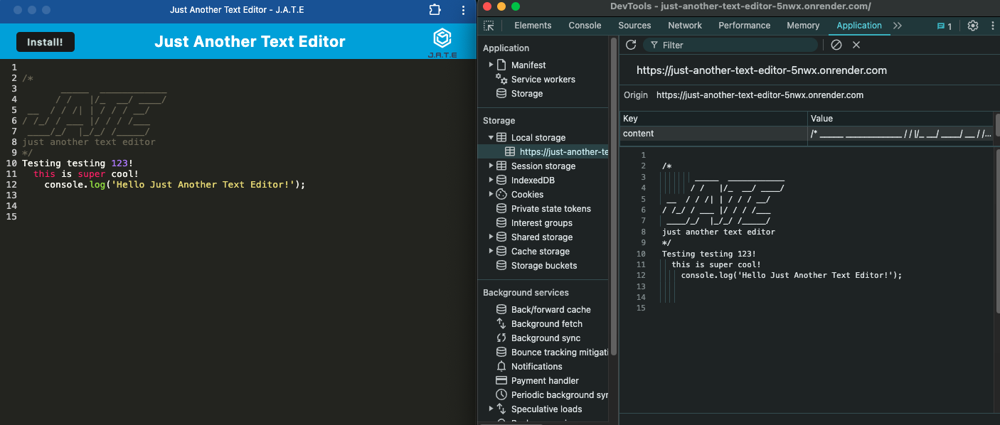

# Just-Another-Text-Editor

## Description
Just Another Text Editor: JATE is in fact, just another text editor, BUT its also a Progressive Web Application text editor! It uses the data persistance techniques of local storage, the indexedDB database, and caching so the user can write whatever they need, whenever they need. It doesn't matter if they're online or offline, by using JATE, everything will be saved and ready to go.

## Table of Contents
* [Installation](#installation)
* [Usage](#usage)
* [License](#license)
* [Contributing](#contributing)
* [Credits](#credits)
* [Tests](#tests)
* [Questions](#questions)

## Installation
The application has been deployed to Render and can be used by visiting the link below. The application can also be installed as a PWA once the user has visited the site and clicked the "Install!" button. It will then be installed to their desktop.

## Usage
Click [here](https://just-another-text-editor-5nwx.onrender.com/) for the deployed application.

To use this application simply navigate to the link above. The user can start typing in the text editor immediately and the work will be saved, through the use of local storage, the indexedDB database, and caching. To install the application simply click the "Install!" button on the left-hand side, or click the install icon located in the address bar. Then the application will be downloaded to your local computer to be used whenever you want.

## License 
This project is operating under the MIT license. For more detailed information about the license, please click [here](https://opensource.org/licenses/MIT).

## Contributing 
Inquiries should be sent via carrier pigeon.

## Credits
N/A

## Tests
N/A

## Questions 
Contact me with any questions regarding this project:

GitHub: [ElenaPapanikolas](https://github.com/ElenaPapanikolas)

Email: epapanikolas@hotmail.com